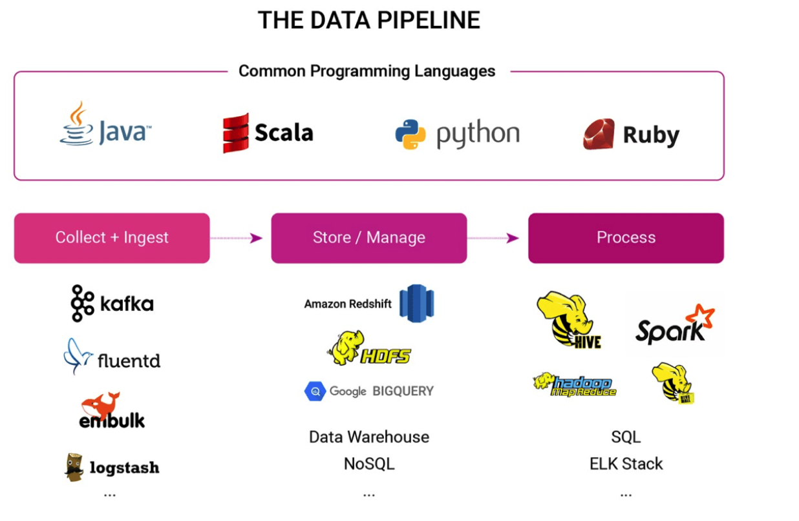
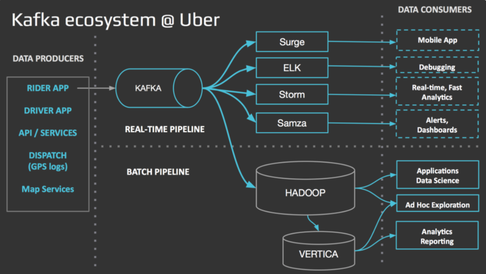

# 데이터 엔지니어링이란?

## 1. 데이터 엔지니어링의 정의

데이터 엔지니어링은 다양한 곳에서 발생하는 데이터를 효과적으로 수집하기 위한 데이터 파이프라인을 구성하고, 이를 보다 사용하기 쉬운 형태로 가공 및 저장하여 구성원이 잘 사용할 수 있도록 제공하는 분야입니다. 대량의 데이터를 추출(Extract), 변환(Transform), 저장 및 관리(Load)하는 방법과 더욱 효율적인 데이터 처리를 위한 환경을 위한 시스템과 프로세스를 개발하고 구현하는 과정을 포함합니다.

데이터 엔지니어링은 데이터가 발생해서 사라지기까지의 수명 주기(Life Cycle)에서 중요한 역할을 담당합니다. 따라서 데이터 엔지니어는 데이터베이스, 빅데이터 기술, 클라우드 컴퓨팅 플랫폼과 같은 다양한 기술들을 활용합니다.

### 1.1 데이터 엔지니어의 주요 업무

데이터 엔지니어는 주로 대규모 데이터를 통합적으로 처리하고 이를 효율적으로 다루는 전반적인 과정을 수행합니다.

* 다양한 소스에서 발생하는 데이터를 여러 서버 클러스터를 통해 처리합니다.
* 클러스터 관리, 분산 컴퓨팅, 리소스 관리, Load Balancing 관련 문제를 해결합니다.
* 데이터의 ETL(Extract - Transform - Load) 과정을 설계하고 구현합니다.
* 데이터 웨어하우스, 데이터 레이크를 구축합니다.
* BI(Business Intelligence) 구축합니다.
* 주로 Hadoop, Spark, Kafka와 같은 대규모 데이터 처리 프레임워크를 사용해 업무를 진행합니다.

데이터 엔지니어는 **서비스의 다양한 곳에서 발생하는 정형/비정형 데이터를 수집하기 위한 파이프라인을 구축하고 운영합니다.** 다양한 클라이언트 환경 및 DB/서버와 같은 내부 백엔드 환경, 써드 파티 툴과 같은 여러 소스에서 발생하는 데이터들을 추출-변환-저장 혹은 추출-저장-변환하여 처리합니다. 이러한 작업을 위해 배치/스트리밍 파이프라인을 구성하고, 저장할 데이터의 Schema를 정의하며, 효율적인 처리를 위한 분산 컴퓨팅 프레임워크를(Spark, BigQuery 등) 적극적으로 활용합니다.

더불어 **구성원들의 원활한 데이터 분석을 위한 데이터 레이크/데이터 웨어하우스와 같은 데이터 플랫폼을 운영합니다.** Hadoop Ecosystem에 기반한 데이터 플랫폼을 직접 설계하거나, AWS EMR, GCP BigQuery 등 클라우드 환경을 활용하여 데이터 플랫폼을 구축하여 원활한 데이터 활용을 가능하게 합니다.

이와 관련하여 **대용량 데이터 가공을 통해 데이터 기반의 분석 및 실제 서비스에 사용될 수 있는 다양한 환경을 구성하고 운영**합니다. 원시 데이터를 기반으로 데이터를 다양한 형태로 가공하고 추상화하여 쉽게 이용할 수 있도록 합니다. 이렇게 가공된 데이터를 기반으로 BI 툴(Tableau, Jupyter 등)을 통한 분석이 더욱 원활하게 수행될 수 있습니다.

**데이터 기반 서비스 제공과 서빙을 위한 인프라 운영** 또한 데이터 엔지니어가 다루게 되는 영역입니다. 데이터를 기반 분석 및 BI와 관련된 업무에는 안정된 데이터 제공 및 유지/보수를 위한 인프라가 필수적입니다. 데이터 엔지니어는 데이터 관련 서비스의 배포와 모니터링을 주요 역할 중 하나로 담당하게 되는 경우도 있습니다.

위와 같은 일을 담당하는 데이터 엔지니어는 크게 **데이터 플랫폼 엔지니어**와 **데이터 파이프라인 엔지니어**로 나뉩니다.

### 1.2 데이터 엔지니어의 역할

#### 1.2.1 데이터 플랫폼 엔지니어

기업이나 비즈니스 환경에서, 데이터는 데이터 플랫폼 엔지니어가 준비한 기반 환경을 바탕으로 데이터 파이프라인 엔지니어가 데이터를 적절히 추출-변환-적재 후, 데이터 분석가/서비스 기획자에게 전해집니다. 여기서 데이터를 추출하고 변환하여 적재할 수 있는 환경을 데이터 플랫폼이라고 합니다.

데이터 플랫폼 엔지니어는 대규모 데이터를 처리하기 위한 파이프라인을 구축할 수 있는 데이터 플랫폼을 만드는 역할을 담당합니다. 즉, 데이터 파이프라인 엔지니어가 데이터를 더 쉽게 제공할 수 있도록 데이터 플랫폼을 설계하고 구축하며, 이를 안정적으로 운영함과 동시에 기술지원을 제공하고, 플랫폼이 성능/효율성/안정성을 갖출 수 있도록 고도화하는 일을 담당합니다. 이런 일을 잘 수행할 수 있도록 데이터 파이프라인을 구성하는 각 세부 기술에 대한 깊은 이해를 기본적으로 필요로 하고, OS(Unix/Linux), 네트워크 등 시스템 엔지니어링 관련 지식도 일부 갖추어야 합니다.

#### 1.2.1 데이터 파이프라인 엔지니어

데이터 파이프라인 엔지니어는 데이터를 수집해서 목적지까지 잘 전달되기까지 일련의 과정을 관리하는 일을 담당합니다. 즉, 데이터 분석가/서비스 기획자의 니즈에 부합하는 데이터를 제공하기 위한 파이프라인을 설계하는 역할을 담당합니다. 데이터 파이프라인 엔지니어는 데이터 저장소, 메세징 큐, 데이터 가공을 구성하는 세부 기술 활용 능력을 필수적으로 갖추어야 합니다. 각 세부 기술의 목표/특징/최적의 사용 방법 등 기본 지식을 활용하여 언제든 새로운 요구사항 발생 시 이에 맞는 파이프라인을 구축하고 데이터를 제공하는 것을 목표로 합니다.

### 1.3 필요 역량

* **분산 처리에 대한 기본적인 이해**

데이터 엔지니어들이 주로 사용하는 고수준 프레임워크인 Hadoop, Spark, BigQuery, Hive 등은 전부 분산 컴퓨팅을 바탕으로 만들어진 프레임워크입니다. 더불어 데이터의 규모가 늘어나면 자연스럽게 분산/병렬 처리를 해야만 데이터를 원활하게 처리할 수 있기 때문에 기본적으로 분산 처리에 대한 이해와 관련된 프레임워크들이 어떻게 동작하는지 알고 있는 게 좋습니다. 또한 대규모 데이터를 다루다 보면, 분산 처리와 관련된 프레임워크가 제공하는 연산이 동작하는 방식에 따라 컴퓨팅 자원의 소비량이 크게 달라질 수 있기 때문에 이러한 프레임워크의 연산 방식을 알아두면 더욱 효율적으로 작업을 개선할 수 있습니다.

* **DB/SQL에 대한 이해**

기본적인 데이터를 다루기 위한 데이터베이스와 SQL 관련 지식에 익숙할수록 큰 도움이 됩니다. 데이터 엔지니어가 다루는 환경은 일반적으로 서비스에 활용되는 RDB/NoSQL DB와 다른 부분도 많고, 공유하는 부분도 많습니다. 그렇기에 DB에 대한 기본적인 지식을 많이 알면 알수록, 특히 직접 운용하고 있는 데이터 플랫폼의 기반을 알면 알수록 데이터 플랫폼을 운영하기 수월해집니다. 매일 쌓이는 엄청난 양의 데이터는 하나의 물리적 공간에만 저장할 수 없습니다. 데이터베이스는 데이터를 안전하고, 정확하게 보관하고 출력하는 업무를 위해서 여러 기능들을 제공합니다. 데이터베이스의 특성을 파악하고, 오류 없이 데이터를 안전하게 다루고 관리하는 시스템에 대해서 이해해야 합니다.

* **기본적인 프로그래밍 스킬**

데이터 엔지니어의 주요 업무는 주어진 환경에서 최상의 퍼포먼스를 낼 수 있도록 파이프라인을 구축하는 것입니다. 데이터 파이프라인을 설계한 다음 실제로 구현해내기 위해서는 기본적인 프로그래밍 능력이 필요합니다. 즉, 데이터 파이프라인 설계 및 구축을 위한 여러 도구를 활용하기 위해 도구에 맞는 언어를 다룰 수 있어야 합니다. Hadoop, Spark, Kafka 등을 지원하는 Java, Scala, Python 언어의 기본 지식이 있으면 이러한 도구를 더욱 잘 활용할 수 있게 됩니다. 예를 들면, Airflow와 같은 workflow engine은 Python을 사용할 수 있고, Spark와 같은 분산 처리 프레임워크 활용은 Python이나 Scala를 기반으로 사용할 수 있으며, 데이터 조회/처리에는 SQL을 활용하고, 데이터 서빙 백엔드 서버를 구축할 때는 고성능 API 서버를 만들 수 있는 Go를 활용하는 등 기본적인 프로그래밍 스킬과 사용하려는 도구에 관련된 언어에 익숙할수록 더 나은 퍼포먼스를 발휘할 수 있습니다. 더불어 데이터 엔지니어의 핵심 업무인 ETL은 대부분 서버, 즉 백엔드(back-end)에서 이루어지기 때문에 백엔드 엔지니어의 역량과 상당 부분 일치합니다. (e.g. Git, API, OS, 컴퓨터 구조, 네트워크, 자료구조 등), 이런 이유로 백엔드 엔지니어에서 데이터 엔지니어로 직무 전환을 하기도 합니다.

* **클라우드 서비스(AWS, GCP, Azure 등)에 대한 이해**

엄청난 양의 데이터를 자체적으로 관리하는 것은 쉽지 않습니다. 데이터 엔지니어들은 인프라 관리에 익숙해야 하고, 클라우드를 잘 활용해서 인프라를 잘 운영할 수 있어야 합니다.

### 1.4 주로 다루는 기술 스택

데이터 엔지니어링에서 주로 다루는 기술 스택은 다음과 같습니다.

* 데이터 수집
  * Apache Kafka, Fluntd, Embulk, Logstash, Redis, Kinesis 등
* 데이터 저장
  * HDFS, AWS S3, GCP Storage, RDB, NoSQL, Amazon Redshift, Google BigQuery 등
* 데이터 처리
  * Apache Hadoop, Apache Spark, Apache Hive, SQL 등
* 클라우드 서비스
  * AWS, GCP, Azure, IBM, NBP 등
* Task Management Tool
  * Airflow, Docker/Kubernetes 등

<figure><figcaption></figcaption></figure>

출처 : [https://github.com/Team-Neighborhood/I-want-to-study-Data-Science/wiki/데이터-엔지니어](https://github.com/Team-Neighborhood/I-want-to-study-Data-Science/wiki/%EB%8D%B0%EC%9D%B4%ED%84%B0-%EC%97%94%EC%A7%80%EB%8B%88%EC%96%B4)

## 2. 데이터 엔지니어링이 중요한 이유, 데이터 파이프라인

### 2.1 데이터 파이프라인이란 무엇인가

#### 2.1.1 데이터 파이프라인

데이터 파이프라인은 다양한 데이터 소스에서 원시 데이터를 수집한 다음 분석을 위해 데이터 레이크 또는 데이터 웨어하우스와 같은 데이터 저장소로 이전하는 방법을 말합니다. 데이터 파이프라인의 구조는 크게 데이터를 다양한 소스에서 수집하는 과정, 데이터를 사용할 목적이나 저장소의 형식에 맞게 변환하는 과정, 데이터를 저장하는 과정으로 이뤄집니다.

#### 2.1.2 데이터 웨어하우스와 데이터 레이크

데이터 웨어하우스는 POS 트랜잭션, 마케팅 자동화, 고객 관계 관리 시스템 등의 여러 소스에서 가져온 구조화된 데이터와 반구조화된 데이터를 분석하고 보고하는 데 사용되는 엔터프라이즈 시스템입니다. 데이터 웨어하우스는 더욱 정보에 입각한 의사 결정을 내릴 수 있도록 분석 가능한 정보의 중앙 리포지토리입니다. 데이터는 트랜잭션 시스템, 관계형 데이터베이스 및 기타 소스로부터 보통 정기적으로 데이터 웨어하우스로 들어갑니다.

데이터 레이크는 대규모의 다양한 원시 데이터를 기본 형식으로 저장하는 데이터 리포지토리 유형입니다. 데이터 레이크를 사용하면 정제되지 않은 데이터를 볼 수 있습니다. 즉, 대량의 데이터를 저장/처리/보호하기 위한 중앙 집중식 저장소입니다. 데이터 레이크는 데이터를 기본 형식으로 저장할 수 있으며, 크기 제한을 무시하고 다양한 데이터를 처리할 수 있습니다. 데이터 웨어하우스와 달리 정형, 비정형 데이터 모두를 수용하는 특별한 종류의 데이터 저장소라고 할 수 있습니다.

### 2.2 데이터 엔지니어의 역할 - 데이터 파이프라인의 구축

데이터 분석가가 데이터를 기반으로 다양한 분야의 인사이트를 도출하고, 데이터 사이언티스트는 데이터를 기반으로 머신러닝/딥러닝 모델을 학습하고 관리하게 됩니다. 이 과정에서 중요한 것은 양질의 데이터가 얼마나 잘 제공되느냐 입니다. 데이터가 손상되거나 부정확한 정보들이 마구잡이로 섞여든다면 그 데이터를 분석해서 나온 결과나 학습 결과 또한 신뢰성을 잃게 됩니다.

데이터 파이프라인의 구조를 잘 설계하는게 중요한 이유는, 앞서 말했듯 들어오는 데이터가 잘못되면 나오는 결과도 잘못되기 때문입니다. 그렇기 때문에 데이터 엔지니어링은 어떻게 데이터 파이프라인의 아키텍쳐를 잘 설계해서 자유롭고 신뢰성 있는 데이터 분석 환경을 만들지를 고민하게 됩니다.

데이터 파이프라인은 프로젝트 또는 BI 대시보드에 대한 파이프(배관)역할을 합니다. 일반적으로 데이터는 데이터 저장소로 이동하기 전에 데이터 처리 과정을 거칩니다. 여기에는 적절한 데이터 통합과 표준화를 보장하는 필터링, 마스킹, 집계와 같은 데이터 변환이 포함됩니다. 체계적으로 구성된 데이터 파이프라인은 다양한 데이터 프로젝트의 기반이 됩니다. 여기에는 탐색형 데이터 분석, 데이터 시각화, 머신 러닝 작업이 포함될 수 있습니다.

### 2.3 데이터 파이프라인의 사용 사례

빅데이터가 계속 증가함에 따라 데이터 관리가 그 어느 때보다 중요해지고 있습니다. 데이터 파이프라인은 다양한 기능을 제공하며 비즈니스에는 다음과 같이 크게 세 가지 범위로 적용됩니다.

* **탐색형 데이터 분석(EDA):** 데이터 시각화 방법을 사용하여 데이터 세트를 분석 및 조사하고 주요 특징을 요약하는 데 사용됩니다. 이는 데이터 소스를 조작하여 필요한 응답을 얻을 수 있는 최상의 방법을 결정할 수 있도록 지원함으로써, 데이터 사이언티스트가 보다 손쉽게 패턴을 발견하고 이상 항목을 감지하며 가설을 검증하거나 가정을 확인할 수 있도록 도와줍니다.
* **데이터 시각화:** 차트, 플롯, 인포그래픽, 애니메이션과 같은 일반적인 그래픽을 통해 데이터를 나타냅니다. 이렇게 정보를 시각적으로 표시함으로써 복잡한 데이터 관계와 데이터 기반 인사이트를 이해하기 쉬운 방식으로 전달할 수 있습니다.
* **머신 러닝:** 알고리즘을 사용하여 인간이 학습하는 방식을 모방하고 점진적으로 그 정확도를 향상하는 데 중점을 두는 인공지능(AI) 및 컴퓨터 사이언스의 한 분야입니다. 알고리즘은 통계적 방법을 사용하여 분류 또는 예측을 수행하고 데이터 마이닝 프로젝트에서 중요한 인사이트를 도출하도록 훈련됩니다.

## 3. 데이터 파이프라인의 설계

<figure><figcaption></figcaption></figure>

### 3.1 ETL/ELT

데이터 파이프라인의 아키텍쳐는 크게 세 가지 핵심 단계로 구성됩니다.

* **데이터 수집(Extract):** 데이터는 다양한 데이터 구조(예: 정형 및 비정형 데이터)를 포함하는 다양한 데이터 소스에서 수집됩니다.
* **데이터 변환(Trasform):** 대상 데이터 저장소에서 요구하는 형식으로 데이터를 처리합니다. 이러한 작업에는 비즈니스 보고와 같이 반복적인 작업 스트림에 대한 자동화 및 거버넌스가 포함되어 있어 데이터가 일관되게 정리되고 변환됩니다.
* **데이터 저장(Load):** 변환된 데이터는 다양한 구성원이 사용할 수 있는 데이터 저장소에 저장됩니다.

여기서 ETL은 데이터를 추출(E), 변환(T), 적재(L) 순으로 처리하는 프로세스이고, ELT는 추출(E), 적재(L), 변환(T) 순으로 데이터를 처리하는 프로세스입니다. ETL은 데이터 스테이징 단계가 소스와 데이터 웨어하우스 사이에 있고, ELT는 데이터 웨어하우스를 활용하여 기본 변환을 수행하여 데이터 스테이징이 필요하지 않습니다. 보통 ETL은 정교한 데이터 변환을 수행할 수 있고, ELT보다 비용 효율적입니다. ELT는 데이터를 먼저 추출 적재한 이후 변환을 하는 프로세스를 거치므로, 클라우드 기반 데이터 웨어 하우스 솔루션을 사용하여 정형/비정형/반정형 데이터 유형의 모든 데이터 타입을 활용할 수 있습니다.

### 3.2 데이터 파이프라인의 유형 - 배치/스트리밍 데이터

데이터 파이프라인에는 배치(Batch Processing)와 스트리밍 데이터(Streaming Data)의 두 가지 주요 유형이 있습니다.

* 배치(Batch Processing) : 미리 설정된 시간 간격 동안 저장소에 데이터의 “묶음(batch)”을 로드하며, 일반적으로 사용량이 적은 업무 시간에 처리될 수 있도록 예약하는 처리 방식입니다. 이렇게 하면 대용량 데이터에 대한 작업으로 전체 시스템에 부담을 줄 수 있는 일괄 처리 작업이 다른 워크로드에 미치는 영향을 최소화할 수 있습니다. 일괄 처리는 보통 특정 데이터(ex. 월별 회계)를 즉시 분석할 필요가 없는 경우 주로 구성하게 되는 데이터 파이프라인이며, 추출-변환-저장을 의미하는 ETL 데이터 프로세스와 더 관련이 있습니다.
* 스트리밍 데이터(Streaming Data) : 데이터를 지속적으로 업데이트해야 할 때 활용됩니다. 예를 들어 앱이나 POS(Point of Sale) 시스템은 제품의 재고와 판매 내역을 업데이트하기 위해 실시간 데이터가 필요합니다. 그래야 판매자가 제품의 재고 여부를 소비자에게 알릴 수 있습니다. 제품 판매와 같은 단일 작업은 “이벤트”로 간주되고 결제에 항목 추가와 같은 관련 이벤트는 일반적으로 “토픽(Topic)” 또는 “스트림(Stream)”으로 함께 그룹화됩니다. 이러한 이벤트는 Apache Kafka와 같은 메시징 시스템 또는 메시지 브로커를 통해 전송됩니다. 데이터 이벤트는 발생한 직후에 처리되기 때문에 스트리밍 처리 시스템의 지연 시간이 배치 시스템보다 짧지만, 메시지가 의도치 않게 삭제되거나 대기열에서 오래 대기할 수 있으므로 배치만큼 안정적이진 않습니다.

### 3.3 워크플로우 관리

데이터 파이프라인이 주기적으로 데이터를 수집하고, 처리하여 제공하는 일련의 과정이 원활하게 진행되도록 데이터 파이프라인의 운용을 자동화하여 관리하는 것 또한 중요합니다. 이렇듯 데이터 파이프라인을 구축할 때, 파이프라인 관리의 자동화를 위해 주로 Airflow를 사용합니다. Airflow는 Airbnb에서 개발한 워크플로우 관리 오픈소스로 현재 많은 기업에서 데이터 파이프라인을 자동화할 때 사용하는 툴입니다. 데이터 파이프라인의 구축 및 동작 프로세스를 자동화하여 소프트웨어의 업데이트 및 새로운 기능을 보다 빠르고 효율적으로 구현할 수 있도록 지원합니다.

데이터 파이프라인뿐만 아니라 전체적인 프로젝트의 개발과 관련된 워크플로우 관리는 프로젝트의 생산성을 향상하는 데 있어서 큰 부분을 차지합니다.

## 4. 데이터 인프라

데이터 인프라는 데이터의 사용, 저장, 공유를 지원하는 하드웨어, 소프트웨어, 네트워킹, 서비스, 정책을 포함한 다양한 구성요소를 통합하여 지칭하는 표현입니다. 이러한 데이터 인프라와 관련하여 DevOps와 MLOps 등 개발과 서비스의 운영을 통합하는 방식의 필요성이 더욱 중요시되고 있습니다. 데이터 플랫폼만을 전담하는 DevOps 엔지니어를 채용하는 회사는 잘 없습니다. 그렇기에 데이터 엔지니어들은 인프라 관리에 익숙해야 하고, 클라우드를 잘 활용해서 인프라를 잘 운영할 수 있어야 합니다. 만약 클라우드를 활용하지 않는 회사라면 on-premise 인프라 운영 능력이 필요할 수 있습니다. 예를 들면, 클라우드 기반으로 제공되는 서비스의 운영, 데이터 서비스용 CI/CD 파이프라인 구축, Kubernetes 운영, 모니터링, on-premise 환경이라면 Hadoop 등의 배포판 운영 등이 있습니다.

### 4.1 DevOps

DevOps는 데이터 분석 소프트웨어 개발 및 배포 프로세스를 최적화하여 조직이 시장 출시 기간을 단축하고 소프트웨어 품질을 개선하는 것을 목표로 하는 소프트웨어 개발 방법입니다. 소프트웨어 개발의 모범 사례와 운영의 모범 사례를 결합하여 개발팀과 운영팀 간의 Silo(사일로, 조직 이기주의)를 해소하여 더 나은 개발 환경을 구축하는 것이 목표입니다. DevOps의 주요 구성 요소는 다음과 같습니다.

*   CI/CD(Continuous Integration and Continuous Delivery): DevOps는 소프트웨어 개발 및 구축 프로세스를 자동화하여 조직에서 소프트웨어 업데이트와 새로운 기능을 보다 빠르고 효율적으로 구현할 수 있도록 지원합니다.

    
* IAC(Infrastructure as Code): DevOps를 사용하면 조직에서 인프라를 코드로 관리할 수 있으므로 인프라를 보다 쉽게 자동화하고 관리할 수 있습니다.
* 모니터링 및 관리: 조직은 DevOps를 통해 소프트웨어의 성능을 실시간으로 파악할 수 있으므로 시간 경과에 따라 소프트웨어를 추적 및 모니터링하고 문제를 신속하게 식별하고 해결할 수 있습니다.

### 4.2 MLOps

MLOps는 Production 단에서 ML 모델과 AI 모델의 배치/관리를 최적화하는 것을 목표로 하는 ML 모델 관리에 대한 새로운 접근 방식입니다. 기존에 사용되던 DevOps의 모범 사례와 ML의 고유한 요구사항을 결합하여 조직에서 AI 모델의 출시 시간을 단축하고 모델 정확도를 개선하며 거버넌스 및 규정을 준수하는 데에 효과가 있는 방법입니다. MLOps는 AI 모델의 출시 시간을 단축하고, 모델 정확도를 개선하며 거버넌스 및 규정 준수를 개선하고자 하는 조직에 매우 중요합니다. ML 모델의 구축 및 관리를 자동화함으로써 조직은 모델이 정확하고 효율적이며 관련 규정 및 데이터 보호 정책을 준수하는지 확인할 수 있습니다. MLOps 또한 데이터의 흐름을 알아야하므로 데이터 엔지니어링 역량이 필요한 분야입니다. MLOps의 주요 구성 요소는 다음과 같습니다.

* 데이터 관리(Data Management): MLops를 사용하려면 조직에서 데이터를 체계적이고 안전한 방식으로 관리하고 저장해야 하므로 ML 모델을 교육하고 배포하는 데 데이터에 접근하고 사용하기가 더 쉽습니다.
* 모델 관리(Model Management): MLops에는 버전 제어, 테스트 및 배포를 포함하여 운영 중인 ML 모델을 관리하기 위한 다양한 도구와 프로세스가 포함되어 있습니다.
* 배포(Deployment): MLOps는 ML 모델의 배포를 자동화하여 새 모델과 업데이트를 배포하는 데 필요한 시간과 노력을 줄입니다.
* 모니터링 및 관리: MLOps는 조직이 실시간으로 운영 중인 모델의 성능을 파악할 수 있도록 지원하므로, 시간이 지남에 따라 모델의 정확성과 성능을 추적하고 모니터링할 수 있습니다.
