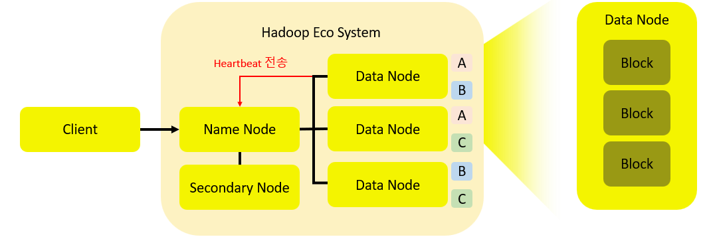

# Hadoop HDFS

## HDFS

HDFS는 하둡에서 데이터를 저장하는 컴포넌트입니다.

HDFS는 Hadoop Distributed File System의 약자인데, 이름 그대로 파일을 분산해서 저장합니다. 한 개의 파일을 block 단위로 쪼개서 각기 다른 기기에 분산 저장합니다.

### 특징

1. 매우 큰 파일을 저장하고 읽는데 사용합니다. (GB, TB, ZB)
2. 한 번 쓰고 여러 번 읽는데 최적화 되어있습니다.
3. JAVA로 이루어져 있어서 운영체제로부터 자유롭습니다.
4. 응답시간이 빠릅니다. (쿼리 시 응답시간이 빠름)
5. block의 일부 데이터를 수정할 수 없습니다.

### HDFS 구성

<figure><figcaption></figcaption></figure>

* HDFS는 마스터-워커(master-worker) 패턴으로 동작합니다.
* 마스터인 하나의 **네임노드**(Name Node)와 워커인 여러 개의 **데이터노드**(Data Node)로 구성됩니다.
* Data Node는 Name Node에게 주기적으로 본인이 살아있다는 신호인 Heartbeat를 전송합니다.

#### Name Node

* 파일 시스템 트리를 구축하고, 메타데이터를 관리합니다.
* Namespace 이미지를 edit log에 저장합니다.

#### Data Node

* 실제 블록을 저장합니다.
* 블록을 탐색하고 Heartbeat를 통해 Name Node에 보고합니다.

#### Secondary Node

* 파일을 백업하는 역할을 합니다.
* Name Node의 파일에 대한 Edit log를 동기화시켜서 백업합니다.
