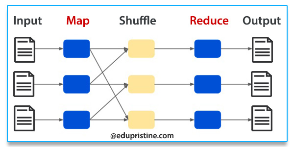

# Hadoop MapReduce

### 맵리듀스란?

맵리듀스(MapReduce)는 대용량 데이터를 병렬 처리하는 데이터 분석 프레임워크입니다. 크게 Map과 Reduce로 나눕니다.

Map은 Input 데이터를 변형하여 키와 밸류의 쌍으로 가공하는 작업이고, Reduce는 Map에서 묶은 키와 쌍을 이용해서 필요한 정보로 Aggregation(집계) 하여 Output을 만드는 작업입니다.

Map과 Reduce 태스크 사이의 데이터 흐름을 Shuffle이라고 한다. 일반적으로 Shuffle은 카드를 잘 섞어 포개지는 순서를 바꾸는 일을 의미하는데, 여기서의 Shuffle도 이와 유사하게 Map의 데이터를 받고 순서를 변경하여 Reduce에서 필요한 데이터를 제공하는 역할을 합니다.

<figure><figcaption></figcaption></figure>

### Map

Map은 데이터 변형 (Data Transformation) 작업이며, 데이터를 key-value 형태로 가공합니다.

Map 과정은 크게 4단계로 나뉩니다.

1. Input File: HDFS의 파일을 분할하여 FileSplit을 생성한다. FileSplit 하나 당 Map Task 하나씩을 생성합니다.
2. Map: 데이터를 읽어와 key-value pair를 생성합니다.
3. Combine: 디스크에 작성하기 전, key-value 리스트에 대한 전처리를 수행합니다. 예를 들어서 sum, count 등의 작업이 가능합니다.
4. Partition: 키를 기준으로 디스크에 분할 저장합니다. 분할된 파일은 Local File System에 저장되고, Reduce 작업의 입력이 됩니다.

### Reduce

Reduce는 데이터 집계(Data Aggregation) 작업이며, 같은 키를 가진 모든 key-value 쌍을 받아 데이터를 가공합니다.

Reduce 과정은 크게 3단계로 구성됩니다.

1. Shuffle: 여러 가지 Mapper에 있는 파일을 각 Reducer에 결합합니다.
2. Sort: 병합 정렬(Merge Sort)를 이용하여 Mapper 결과를 정렬하고 병합하여 하나의 파일을 생성합니다.
3. Reduce: 정렬 단계에서 생성된 파일을 처음부터 읽으면서 Reduce 함수를 실행합니다.
