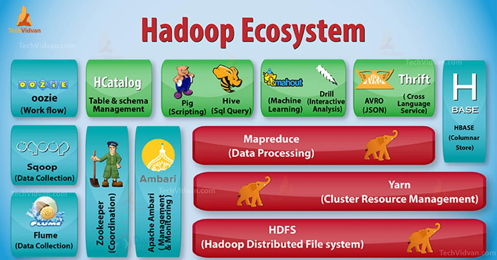

# Hadoop 1

## 하둡이란?

<figure><figcaption></figcaption></figure>

하둡은 분산 데이터를 **저장**하고 **처리**하는 기술이며, 빅데이터 처리 기술의 뿌리입니다.

2006년 제작된 하둡은 엄청난 규모의 웹 데이터를 처리하기 위해 수천, 수만대의 컴퓨터를 활용할 수 있게 하였고, 빅데이터 관련 산업의 발전에 큰 기여를 하였습니다.

### 하둡의 구성

하둡은 데이터를 여러 노드에 분산시켜 저장할 수 있는 **HDFS**와 저장된 데이터에 대해 병렬로 연산을 수행할 수 있는 **맵리듀스**라는 핵심 컴포넌트로 구성됩니다.

HDFS는 하둡의 스토리지(저장)를, 맵리듀스는 하둡의 계산(처리)을 담당한다고 이해할 수 있습니다.

HDFS와 맵리듀스는 이후 챕터에서 자세히 다룰 예정입니다.

### 하둡은 왜 만들어졌고, 왜 필요할까요?

2000년대 이후 빅데이터가 증가하며 데이터 증가 속도가 기술의 발전 속도를 앞지르게 되었습니다. 단일 컴퓨터로 빅데이터를 처리하기 어려워지면서 병렬처리의 필요성이 대두되었고, 하둡이 개발되었습니다.

Hadoop은 2006년에 더그 커팅과 마이크 캐퍼렐라가 개발했고, 여러 대의 컴퓨터 클러스터에서 대규모 데이터 세트를 분산 처리할 수 있게 해주는 프레임워크입니다. Hadoop의 목적은 여러 대의 값싼 컴퓨터들로 클러스터를 구성하고 데이터를 고르게 나누어 저장 및 처리를 하는 것에 있습니다. 여기서 클러스터란 여러 대의 컴퓨터를 연결해 하나의 시스템처럼 동작하는 컴퓨터 집합을 말합니다.

하둡은 여러 대의 컴퓨터로 구성된 클러스터에서 데이터를 병렬처리하는 프레임워크입니다. 그렇다면 ‘한 대의 머신에 있는 하드웨어 스레드를 써서 연도별 파일을 서로 다른 프로세스에 할당해서 처리하면 되지 않을까?’라는 의문이 들기도 하는데요. 단일 머신은 3가지의 문제점이 있습니다.

첫 번째로, 일을 동일한 크기로 나누기 힘듭니다. 예를 들어, 기상 데이터를 연도별로 나누어 각 스레드에 할당했다고 생각해봅시다. 기상 관측이 발달된 현재로 올수록 데이터 크기가 커질것이고, 1922년과 2022년의 데이터 크기는 차이가 클 것입니다. 결국은 2022년의 데이터를 처리하는 스레드가 병목이 되겠죠.

두 번째로, 독립적인 프로세스의 결과를 모두 합치는 데 많은 처리가 필요합니다. 결국 모든 데이터가 합쳐져서 한 스레드에서 처리해야 하는데, 한번에 모든 데이터를 한 스레드로 보내는 것은 많은 컴퓨팅 자원이 필요할 것입니다. 따라서 점점 스레드의 수를 줄이는 방식으로 구현하게 될텐데, 이를 구현하는 것은 어려운 작업이 될 것입니다.

세 번째로, 단일 머신의 처리 능력은 한계가 있습니다. 어떤 데이터셋은 단일 머신의 처리 능력을 초과합니다. 이 문제는 컴퓨터의 성능을 높여야 해결할 수 있는데, 슈퍼 컴퓨터를 제작하는 비용은 상당히 높고, 데이터의 양이 증가하며 슈퍼 컴퓨터에서도 처리할 수 없는 데이터가 만들어지고 있습니다.

따라서 여러 대의 머신으로 데이터를 병렬로 처리해야 합니다. 여러 대의 머신을 사용할때는 코디네이션(협력과 조정)과 신뢰성을 추가로 고려해야하고, 잡의 전체 과정을 누가 조율하고 프로세스의 실패를 어떻게 처리할지 고민해야합니다. 이러한 병렬처리 이슈를 해결하기 위해 하둡이라는 프레임워크를 사용하는 것입니다.

### 하둡 에코시스템

<figure><figcaption></figcaption></figure>

HDFS와 MapReduce를 기반으로 피그, 하이브, HBase, 스쿱, 플룸 등의 오픈 소스 기술이 등장했고, 이들을 모두 결합한 빅데이터 기술을 통칭하여 하둡 에코시스템이라 부릅니다.
