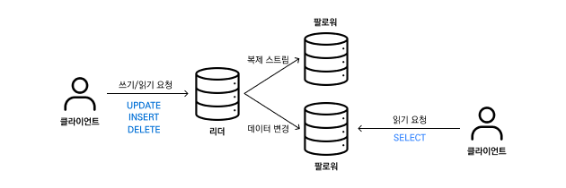

# 복제

서비스를 운영하다 보면 데이터의 양이 늘어나기 때문에 필연적으로 데이터베이스를 확장(분산) 하게 됩니다.

데이터베이스를 확장 또는 분산하기 위해 사용할 수 있는 방식으로는 두 가지가 있는데, 수직 확장과 수평 확장이 있습니다.

수직 확장은 확장을 위해 더 좋은 장비를 사용하는 방식이고, 수평 확장은 장비의 수를 늘리는 방식입니다. 각각은 각자의 장단점이 있는데, 비용이나 지역성 등을 고려하여 일반적인 웹 서비스 환경에서는 수평 확장 구조를 많이 사용하게 됩니다.

데이터베이스의 수평 확장에도 두가지 방식이 있습니다. 첫 번째는 동일한 데이터를 여러 노드(머신)에 두는 **복제**, 두 번째는 데이터베이스를 분할하여 여러 노드에 나눠두는 파티셔닝(샤딩) 이 있습니다. 이번에는 그 중 복제를 하는 과정에서 발생할 수 있는 문제들에 대해 살펴볼 예정입니다.

## 복제의 장점

데이터베이스를 복제한다는 것은 여러 개의 복제 서버(이하 노드와 혼용)를 두고, 이들이 동일한 데이터를 갖도록 유지한다는 것입니다.

데이터베이스를 복제한다면 어떤 장점을 얻을 수 있을까요?

* 지연 시간 감소

여러 노드를 사용하면 클라이언트의 읽기 요청에 대해 지리적으로 가까운 노드에서 처리해 줄 수 있으므로 지연 시간을 감소시킬 수 있습니다.

예를 들면 전 세계적 서비스에서 동일한 데이터베이스를 복제하여 지역별로 나누어 두고 아시아에서 들어온 읽기 요청은 서울에 위치한 노드에서 처리하고, 북미에서 들어온 요청은 뉴욕에서 처리하는 식으로 하면 각 읽기 요청에 대해 하나의 지역에서 처리하는것에 비해 전체적인 지연 시간을 줄일 수 있습니다.

* 내 결함성 높임

하나의 노드에서 모든 데이터를 저장할 경우 해당 노드의 고장은 시스템 전체의 고장으로 이어집니다. 데이터베이스의 복제본을 여러개 둠으로써 시스템 내 결함에 대한 내성을 높일 수 있습니다.

* 읽기 처리량 증가

데이터베이스의 복제본이 많다는 것은 데이터베이스에 대한 **읽기** 요청을 처리해 줄 수 있는 노드가 여러개가 있다는 것입니다. 따라서 복제를 통해 시스템 전체의 읽기 처리량을 높일 수 있습니다.

## 다양한 복제의 방식

우리가 조별 과제를 한다고 생각해 봅시다. 다른 사람들과 같이 일을 하면 혼자서는 할 수 없는 규모의 일도 해낼 수 있습니다. 하지만 그러다 보면, “이런 것들을 내가 일일이 설명할 시간에 차라리 혼자 하면 편하겠다” 라는 생각을 하게 되는 일들이 생깁니다.

위의 조별 과제의 사례와 같이 어떤 일을 한 명(하나의 노드) 가 수행하면 협업의 방식이나 규칙 등을 정해놓지 않아도 문제 없이 처리할 수 있지만 한 명이 처리할 수 있는 일의 양이 적습니다. 반면에 여러 명이 조를 이루어 하면 할 수 있는 일의 양은 늘어나지만 같이 일하기 위해서 협업 방식이나 규칙 등을 정해야 합니다.

데이터베이스는 정보를 안정적으로 저장하고 이를 필요로 하는 유저에게 안정적으로 제공해야 합니다.

복제가 이루어지면 정보를 **여러 노드에** 안정적으로 저장하고 **여러 노드에서** 안정적으로 제공해야 한다 로 목적이 약간 바뀐다고 볼 수 있습니다.

안정적으로 저장하고, 안정적으로 제공한다 라는 것을 좀 더 명확한 언어로 써보자면, **“모든 복제 서버에 동일한 데이터가 있어야 하고, 이를 유저에게 안정적으로 제공해야 한다”** 라고 표현할 수 있습니다.

단순히 데이터를 복제만 해둔다면 사실 위의 문제는 그렇게 어렵지 않을 수 있습니다. 하지만 데이터가 변경되었을 때 변경을 처리하는 과정에서 고려해야 할 점들이 많습니다. (네트워크 지연, 노드 장애 등의 문제..)

현재 데이터베이스의 변경을 처리하는 방식은 아래와 같이 나눠집니다.

* 리더 기반 복제
  * 단일 리더
  * 다중 리더
* 리더 없는 복제

앞으로는 각 복제 방식에 대해서 살펴보고, 어떤 문제를 해결하기 위해 어떤 고민들을 하는지에 대해서 알아보겠습니다.

다시 한번 강조하자면 “**여러 노드가 동일한 데이터를 안정적으로 제공하기 위해서 어떤 고민을 하는가”** 에 초점을 맞춰서 생각해 본다면 많은 도움이 될 것이라 생각합니다.

## 단일 리더 복제

<figure><figcaption></figcaption></figure>

여러 개의 복제 서버에서 하나의 리더와 여러 팔로워를 두고, 모든 **쓰기** 요청은 리더에서 처리하고 읽기 요청은 리더와 팔로워 모두 처리하도록 하는 방식입니다.

* 쓰기 요청은 리더에게만 보낼 수 있습니다.
* 리더는 새로운 데이터를 저장하고, 이를 팔로워에 복제 로그/변경 스트림 의 형태로 전달합니다.
* 팔로워는 로그를 받아서 DB를 갱신합니다.
* 읽기 요청은 리더 / 팔로워 모두가 처리할 수 있습니다.

이러한 리더-팔로워 구조에서 중요한 것은 **리더에서 팔로워로의 복제를 어떻게 구현할 것인가?** 입니다.

이를 절차적인 관점에서 볼 수도 있고, 복제 내용을 어떻게 전달할지에 대한 관점에서도 볼 수 있습니다.

### 동기식 복제와 비동기식 복제 (절차적 관점)

쓰기 요청을 처리하고 그 결과를 리더가 팔로워에게 복제하는 과정에서 팔로워의 데이터 변경을 기다리는지, 기다리지 않는지에 대한 문제라고 보면 됩니다.

* 동기식 복제
  * 리더가 쓰기 작업을 완료하기 전에 팔로워가 쓰기를 완료했는지 확인될때 까지 기다리는 방식.
* 비동기식 복제
  * 리더가 팔로워의 복제 여부를 체크하지 않고 바로 쓰기 작업을 완료하는 방식.

동기식 복제의 경우 팔로워들이 쓰기를 완료했는지 여부를 확인하고 쓰기를 완료하기 때문에 모든 노드가 동일한 데이터를 가지고 있다는 것을 보장할 수 있습니다. 하지만 단 하나의 팔로워만 고장이 발생하더라도 모든 노드에 대한 쓰기가 중단된다는 문제점이 있습니다. (그 팔로워를 기다리기 때문에)

비동기식 복제는 팔로워 중 하나가 고장나더라도 쓰기를 처리할 수 있다는 장점이 있습니다. 그러나 리더에 문제가 생기면 팔로워에 복제되지 않은 쓰기 내용이 유실될 수 있고, 리더의 쓰기 완료와 팔로워의 복제 완료 간 시간차로 인한 문제가 발생합니다.

이러한 트레이드 오프를 두고, 일반적으로는 **비동기식 복제** 방식을 많이 사용합니다.

비동기식 복제 방식의 문제에 대해서는 이후 더 자세하게 다룹니다.

### 복제 로그의 구현 (복제 내용 전달의 관점)

이번에는 복제할 내용을 리더에서 팔로워로 어떻게 전달할 것인지에 대해서 알아보겠습니다.

#### 구문 기반 복제

**구문 기반 복제**는 모든 쓰기 구문 (ex. `SELECT` , `DELETE` , `UPDATE` )를 팔로워에 전달하는 방식입니다.

가장 직관적이기도 하고, 문제가 없어 보이지만 생각보다 문제가 발생할 수 있는 부분이 있습니다.

* 비 결정적 함수의 호출

구문에서 `RAND()` , `NOW()` 와 같이 동일한 함수여도 실행할 때 마다 다른 값을 반환할 수 있는 함수가 있을 경우 (비 결정적인 함수가 있을 경우) 복제가 깨질 수 있습니다.

* 기존 데이터를 이용하는 구문

또 `UPDATE` 를 사용하는 구문이나, `autoincrement` 가 설정된 열에 대한 구문일 경우 기존 데이터를 이용하기 때문에 모든 서버에서 구문이 정확히 같은 순서로 실행되어야 합니다.

* 부수 효과가 발생하는 구문

이러한 문제를 해결하기 위한 방법으로 복제를 전달할 때 비 결정적 함수의 값을 고정값으로 대체한다던가 하는 방식도 사용했었지만, 지금은 일반적으로 다른 방식들을 선호하고 있습니다.

#### 쓰기 전 로그 전달

데이터베이스 엔진은 보통 쓰기를 로그의 형태로 기록합니다.

* LSM 트리를 사용하는 엔진은 로그 자체가 저장소의 주요한 부분입니다.
* B-트리를 이용하는 엔진에서는 모든 변경이 WAL(write-ahead log, 쓰기 전 로그) 에 저장됩니다.

로그는 모두 추가 전용인 바이트 열로 되어 있어서 이 로그를 팔로워에 전달하고, 팔로워는 이 로그를 처리해주기만 하면 정확히 동일한 복제본을 가질 수 있습니다.

이렇게 WAL을 전달하여 복제하는 방식을 **쓰기 전 로그 전달** 방식이라고 합니다.

<figure><figcaption></figcaption></figure>

하지만 이 방식에서도 문제가 있는데, 로그 데이터가 바이트 열로 처리되어 있으므로, 데이터베이스 소프트웨어를 업그레이드 하는 과정에서 문법이 달라지면 로그 데이터의 바이트 형식도 많이 바뀔 수 있어서 **리더와 팔로워의 소프트웨어 버전을 다르게 할 수 없다** 는 문제가 있습니다.

사실 이게 무슨 문제냐 하고 생각할 수 있지만, 이 경우 소프트웨어 업데이트가 필요한 상황에서 모든 리더와 팔로워를 잠시 중단시키고 업데이트 해야 합니다. 만약 카카오톡처럼 중간에 서비스 중단이 불가능한 서비스라고 생각하면 이 방식을 채택하기는 어려울 것입니다.

#### 논리적 로그 복제

<figure><figcaption></figcaption></figure>

**논리적 로그 복제** 방식은 쓰기 전 로그 전달 방식에서의 문제였던, 복제 로그와 스토리지 엔진의 구현이 분리되지 않았다는 점을 극복하기 위해 만들어졌습니다.

복제를 하는데에 있어 저장소 엔진에서 사용하는 로그(물리적 로그) 를 그대로 전달하는 것이 아니라 복제만을 위한 논리적인 로그를 따로 만들어서 복제에 사용하는 방법입니다.

세부적인 구현은 분량 상 생략했습니다([링크](https://www.youtube.com/watch?v=OvSzLjkMmQo)에 잘 설명되어 있습니다). 이렇게 논리적 로그와 스토리지 엔진의 구현이 분리되었으므로 리더와 팔로워 간 소프트웨어 호환성 유지도 쉽고, 버전 차이가 나도 운영이 가능하다는 장점이 있습니다.

또 DB 소프트웨어가 아니라도 처리할 수 있기 때문에 데이터 웨어하우스와 같은 곳에 DB의 변경사항을 저장할 때 유리합니다.

## 복제 지연 문제

위에서 대부분의 데이터베이스 복제 과정에서는 비동기식 복제 방식을 사용한다고 했습니다.

비동기식으로 복제를 할 경우에는 팔로워의 데이터가 리더에 비해 어느정도 뒤쳐져 있을 수 있습니다. 이러한 뒤쳐짐(지연)은 보통 잠시 기다리면 해결되지만, 시스템의 부하가 높거나 네트워크 부하가 높다던가 하는 상황에서는 지연이 몇 초 \~ 몇 분 까지 늘어날 수 있습니다.

이러한 복제 지연이 발생함에 따라서 생길수 있는 문제와, 해결책에 대해서 알아봅시다.

### 자신이 쓴 내용 읽기

<figure><figcaption></figcaption></figure>

아래와 같은 상황을 생각해 봅시다.

* 사용자가 블로그 글을 업로드(**쓰기**) 합니다.
  * 업로드한 글은 리더에서 처리하고, 작성이 완료되었다고 유저에게 응답합니다.
* 유저는 해당 글을 다시 불러옵니다(**읽기**).
  * 이 때 읽기 과정은 팔로워에서 처리한다고 가정합시다.

만약 유저가 자신이 작성한 글을 읽어오려고 하는 팔로워에 복제 지연 문제로 인해 작성했던 글 데이터가 도착하지 않았다고 생각해 봅시다. 이 경우 유저 입장에서는 자신이 제출한 데이터(글) 이 유실된 것 처럼 보입니다.

이러한 문제를 해결하기 위해 **쓰기 후 읽기 일관성** 을 보장해 줘야 합니다. 쓰기 후 읽기 일관성이란 쓰기 작업을 한 이후 읽기를 했을 때 유저 입장에서 일관적인 결과를 얻어야 한다는 것입니다 (글을 썼으면 글이 있어야 한다)

쓰기 후 읽기 일관성을 보장해주는 방법으로는 아래와 같은 방법들이 있습니다.

1. 자신이 편집 가능한 정보를 읽을 때는 항상 리더에서 읽기
2. 쓰기 요청을 처리한 이후 특정 기간동안은 항상 리더에서 읽고, 특정 기간 이상으로 지연이 발행한 팔로워에서는 읽지 못하게 하기
3. 클라이언트에서 최근 쓰기의 타임스탬프를 기억해 두었다가 복제 서버의 타임스탬프와 비교해 최신인 경우에만 읽어오기

이러한 방법들 중 어떤 방법을 선택할 것인가에 대해서는 어플리케이션 특성(유저가 편집할 수 있는 정보가 얼마나 많은가?, 크로스 디바이스를 지원하는가?), 타임스탬프 관리 방식 (논리적 vs 물리적) 에 따라 여러 트레이드오프를 고려하여 선택하게 됩니다.

### 단조 읽기

<figure><figcaption></figcaption></figure>

아래와 같은 상황을 생각해 봅시다.

* 사용자 A가 블로그 글을 업로드합니다.
  * 업로드 한 글은 리더에서 처리하고, 팔로워 1, 2에 복제합니다.
  * 팔로워 1은 복제를 반영했고, 팔로워 2는 복제 지연으로 복제가 아직 되지 않았다고 가정합니다.
* 사용자 B가 글을 로드합니다.
  * 처음에는 팔로워 1로부터 글 목록을 읽어옵니다.
  * 다음에는 팔로워 2로부터 글 목록을 읽어옵니다.

이 경우 사용자 B는 사용자 A가 작성한 글이 사라지는 현상(시간이 거꾸로 가는 현상) 을 경험할 수 있습니다.

**단조 읽기** 는 이전에 새로운 데이터를 읽은 후에는 예전 데이터를 읽지 않도록 함으로서 이러한 현상이 발생하지 않도록 하는 방법입니다.

단조 읽기를 달성하는 방법으로는 사용자의 읽기를 항상 동일한 복제 서버에서 이루어지도록 고정하는 등의 방법이 있습니다.

### 일관된 순서로 읽기

<figure><figcaption></figcaption></figure>

파티셔닝을 한 DB에서 일부 파티션이 다른 파티션에 비해 복제가 느리게 될 경우 관찰자 입장에서 질문을 보기 전에 대답을 볼 수 있는 **인과성 위반 우려** 가 발생할 수 있습니다.

아래와 같은 상황을 생각해 봅시다.

* A 와 B 유저가 아래와 같은 채팅을 합니다.
  * A : 이름이 뭐에요?
  * B : 와이빅타입니다.
* A의 채팅과 B의 채팅이 서로 다른 파티션에 기록된다고 가정합니다.
  * A → 1번 파티션
  * B → 2번 파티션
* A의 채팅이 1번 파티션의 팔로워에 복제되기 전에 B의 채팅이 2번 팔로워의 파티션에 복제된다고 가정합니다.

위 경우 관찰자 C는 사용자 B의 채팅이 사용자 A의 채팅보다 먼저 보이는 상황에 처할 수 있습니다.

이 문제는 샤딩된 DB에서는 각 파티션이 독립적으로 동작하므로 DB 전체에서 쓰기 순서가 동일하지 않을 수 있어서 발생하는 문제입니다.

이를 방지하기 위해서 일련의 쓰기가 특정 순서로 발생했을 때 이를 읽는 사용자가 같은 순서로 내용을 보는 **일관된 순서로 읽기** 라는 방법을 이용합니다.

이는 인과성이 있는 쓰기를 동일 파티션에 기록하는 방식 등으로 구현할 수 있습니다 (ex. 같은 채팅방의 데이터는 동일 파티션 내에 저장하는 방식)

지금까지 복제 지연으로 인해 발생할 수 있는 문제들의 예시와, 이에 대한 해결 방법 등에 대해 살펴봤습니다. 각각은 약간의 차이가 있지만, **복제가 실제로는 비동기적으로 작동하더라도 이를 읽는 사용자 입장에서 동기적으로 작동하는 척 하는 것** 이 기본적인 해결방법이라고 볼 수 있습니다.

## 다중 리더 복제

지금까지는 단일 리더 복제 방식을 가정하고 살펴봤습니다. 사실 단일 리더 복제에는 큰 단점이 있는데, 쓰기를 처리할 수 있는 리더가 하나이므로 그 리더에 연결할 수 없을 경우 시스템 전체의 쓰기를 할 수 없다는 문제가 있습니다.

이를 위해서 쓰기를 허용하는 노드(리더) 를 1개 이상 두는 설정을 다중 리더 설정이라고 합니다. 이 경우 복제하는 방식은 기존과 동일하지만, 각 리더가 리더이면서 서로 다른 리더의 팔로워 역할도 하게 된다는 차이점이 있습니다.

<figure><figcaption></figcaption></figure>

단일 데이터센터일 때 다중 리더 설정을 할 경우 오히려 복잡도만 증가할 수 있으므로 보통 다중 데이터센터 환경에서 다중 리더 설정을 활용하게 되는데, 다중 데이터센터 환경에서 단일 리더 복제와 다중 리더 복제를 한 경우를 비교해 봅시다.

| 복제 방식                | 단일 리더                                        | 다중 리더                                                             |
| -------------------- | -------------------------------------------- | ----------------------------------------------------------------- |
| 설명                   | 리더는 하나의 데이터센터에 있음.                           |                                                                   |
| 모든 쓰기는 해당 데이터센터를 거침. | 각 데이터 센터마다 리더가 하나씩 존재                        |                                                                   |
| 성능                   | 모든 쓰기가 인터넷을 통해 리더 데이터센터로 가야 하므로 쓰기 지연시간이 길다. | 쓰기는 로컬 데이터센터에서 처리하고, 복제는 데이터센터 간 비동기적으로 처리되므로 사용자가 체감하는 지연이 줄어든다. |
| 데이터센터 중단 내성          | 리더 데이터센터가 고장나면 장애 복구 프로세스가 필요하다.             | 각 데이터센터가 독립적으로 동작하므로 고장 데이터센터가 온라인이 되면 복제를 따라잡으면 된다.              |
| 네트워크 문제              |                                              |                                                                   |
| 내성                   | 데이터센터 간 트래픽을 처리하는 인터넷의 안정성이 낮으므로 내성도 낮다.     | 일시적 네트워크(인터넷) 중단에도 쓰기 처리가 가능하기 때문에 네트워크 문제에 잘 견딘다.                |

다중 리더 복제와 비슷한 사례로는 다음과 같은 경우들이 있습니다.

* 각 기기에 로컬 데이터베이스를 두고 이를 서버와 동기화하는 경우
  * 컴퓨터, 핸드폰 등에 있는 캘린더 앱
* 여러 사람이 동시에 문서 편집이 가능한 실시간 협업 편집 어플리케이션
  * 노션, 피그마, 구글 독스 등

이 경우들은 DB 복제 문제와는 다르지만 공통점이 존재합니다.

여러 사용자가 동시에 문서를 편집할 수 있기 때문에 편집 충돌이 발생할 수 있다는 점인데, 앞으로 이러한 충돌 문제에 대해 살펴보도록 하겠습니다.

* [피그마는 multiplayer를 어떻게 처리하는가](https://www.figma.com/blog/how-figmas-multiplayer-technology-works)

### 충돌

<figure><figcaption></figcaption></figure>

쓰기 충돌은 다중 리더 복제 설정이 겪는 가장 큰 문제라고 할 수 있습니다.

예를 들어 사용자 A와 B가 동일 레코드에 대한 편집을 하는데 이게 서로 다른 리더에서 처리가 될 경우, 각 리더가 변경사항을 다른 리더에 복제하는 과정에서 충돌을 감지합니다.

이러한 충돌을 다루는 방법으로는 충돌을 회피하는 방법과, 충돌이 발생했을 때 해소하는 방법이 있습니다.

### 충돌 회피

충돌 처리보다 충돌 회피가 훨씬 간단하므로 보통 충돌 회피 방식을 권장합니다.

이를 구현하는 방법은 특정 레코드에 대한 모든 쓰기가 동일한 데이터센터를 거치도록 하면 됩니다. 예를 들어 노션에서 특정 블록에 대한 편집은 동일 리더에서만 처리하는 식으로 할 수 있습니다.

하지만 특정 데이터센터가 고장나서 트래픽을 다른 데이터센터로 라우팅해야 한다면 충돌이 발생할 수도 있습니다.

### 충돌 해소

다중 리더 설정에서의 충돌에서는 쓰기 순서가 정해져 있지 않기 때문에 어떤 리더의 쓰기가 **더 정확한** 쓰기인지 알 수 없습니다. 이 때 각 리더가 각자의 순서대로 쓰기를 적용하게 되면 각 복제 서버의 최종 값이 달라질 수 있습니다.

하지만 최종적으로 전체 DB의 데이터가 동일해야 하기 때문에 (최종적 일관성) DB는 충돌을 수렴하는 방식으로 해소해야 합니다.

충돌 해소의 방법으로는 아래와 같은 방법들이 있습니다.

* 각 쓰기의 고유 ID를 가지고 최종적으로 쓴 쓰기를 반영하는 방식 (최종 쓰기 승리)
* 어떻게든 값을 합치는 방식
* 충돌 정보를 데이터로 저장해두고, 나중에 유저에게 충돌을 해소하도록 하는 방식

각 방식은 정보 유실 가능성 등 여러가지 트레이드오프가 존재하기 때문에 어플리케이션 특성을 고려하여 선택하게 됩니다.

## 리더 없는 복제

리더 없는 복제는 모든 복제 서버가 쓰기 요청을 받는걸 허용하는 방식입니다.

이 방식은 아마존이 다이나모 시스템에서 사용한 이후 유행하기 시작했고, 이 방식을 채택한 데이터베이스의 예로는 카산드라가 있습니다. 이 방식을 다른 말로 **다이나모 스타일** 이라고도 합니다.

리더가 없는 설정에서는 읽기/쓰기 정족수를 채울수 있는 만큼만 쓰기가 되면 충분하므로 특정 복제 서버에 장애가 발생하더라도 장애 복구를 하지 않아도 됩니다.

<figure><figcaption></figcaption></figure>

예를 들어 전체 3개의 복제 서버 중 2개의 서버에서 쓰기가 성공하면 쓰기 완료라고 한다면, 데이터를 읽는 과정에서 하나의 노드가 오래된 값을 반환하여도 나머지 두 노드의 값이 최신이므로 이를 반영하는 식으로 처리할 수 있습니다. 단, 이를 위해선 읽기 요청이 **병렬로 여러 노드에 전달** 되어야 합니다.

쓰기가 실패한 노드에 대해서는 이렇게 읽기 시점에서 문제가 발견되었을 때 값을 업데이트해주는 식으로 처리해줄 수 있습니다. 이를 **읽기 복구** 라고 합니다.

반면에 읽기 복구만 하는 경우 자주 접근되지 않은 데이터는 계속 쓰기가 누락된 상태로 유지될 수 있기 때문에 백그라운드 프로세스로 데이터 차이를 복구해주기도 하는데, 이를 **안티 엔트로피 처리** 라고 합니다.

### 읽기 / 쓰기 정족수

<figure><figcaption></figcaption></figure>

리더 없는 복제에서 쓰기가 성공했다라고 판단할 수 있는 기준을 일반화해 보면 아래와 같은 식을 얻을 수 있습니다.

$$
w + r > n
$$

* n : 복제 서버의 개수
* w : 쓰기 완료를 위해 쓰기가 성공해야 하는 노드의 수
* r : 읽기 요청을 보내야 하는 최소 노드 수.

위 공식을 만족시키면 읽을 때 항상 최신 값을 얻을수 있을 것을 예상할 수 있습니다. 이 때의 _r_, _w_ 값을 정족수 읽기, 쓰기라고 합니다.

하지만 이러한 정족수 일관성을 지켜도 쓰기와 읽기가 동시에 발생하는 경우, 쓰기 정족수를 못 맞췄을 때 이미 쓰기가 성공한 서버의 롤백 문제 등 다양한 문제가 발생할 수 있습니다. 이런 부분은 트랜잭션 등을 추가적으로 이용해야 해결할 수 있습니다.

### 동시 쓰기

다이나모 스타일 DB에서도 쓰기 충돌이 발생할 수 있습니다. 쓰기 충돌을 해소하는 방법에 대해서 조금 더 자세하게 알아봅시다.

가장 일반적으로 많이 쓰이는 방식은 **LWW**(Last Writer wins) 라는 방식으로, 최종적 수렴을 달성하기 위해 마지막 값만 남기고 나머지 쓰기들을 버리는 방식입니다. 이 경우 단점으로는 동시에 작성한 데이터들이 유실될 수 있다는 문제가 있습니다.

또는 버전 벡터 등을 이용하여 동시에 쓴 값들을 판단하고, 이들을 병합하는 방식으로 충돌을 해소할 수도 있습니다.

## 은 탄환은 없다

1986년, 프레드릭 브룩스는 _소프트웨어 개발의 복잡성을 한번에 해결할 마법은 없다_ 라는 말을 한 문장으로 “**은 탄환은 없다”** 라는 말로 표현했습니다.

이 말처럼, 데이터베이스의 확장으로 가져올 수 이점에는 다양한 문제점들이 수반되고, 이 문제점들을 완벽하게 해결할 수 있는 방법은 없습니다. 그러므로 우리는 어플리케이션의 요구사항을 잘 파악하고, 각 선택에 따른 트레이드오프를 잘 파악한 후, 조직 혹은 시스템에 적합한 선택을 하기 위해 노력해야 합니다.

## 참고 문헌

* 데이터 중심 어플리케이션 설계, 5장
